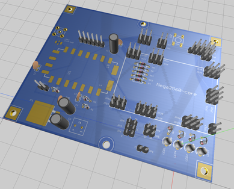

# LART/1

Arduino Software for an APRS Tracker 

a.k.a Livermore Amateur Radio Club APRS Tracker (LART/1) 
# Introduction
This arduino software provides an aprs tracker, which can act as an APRS beacon transmiter or Receiver.  In beacon mode, it can send out APRS position reports (lat/lon and altitude). It also acts as an APRS receiver (KISS interface planned).  
Unlike commerical units, this tracker was designed for low cost and easy of use. 

# Features
+ Reads configuration from SD card (and can writes log file)
+ Send APRS position reports (fields sent: lat/lon/altitude/comments)
    + A PHGD (Power, Height, Gain and Directivity) option available
+ Adaptive Interval Beacon Mode (NotSoSmart_Beacon mode) 
    + adjusts update intervals based on degree of position change (includes change precision setting) 
+ Adjustable Update Intervals 
+ Adjustable APRS packet settings
    + path routing, dest, preamble, tail, symbol 
+ Adjustable Transceiver Settings 
    + Freq, CTCSS Tones, Squelch, Bandwidth, Filters,  and Volume
+ Receives APRS message and print output
    + KISS interface planned 
+ LCD Display with Status LEDs
    

# Hardware
LART1 requires/assumes the following hardware:
+ an Mega2560 compatible arduino board
+ APRS circuit based on the MicroModem Circuit. A schematic is provided.  
+ GPS that provides NMEA output.  The Ublox Neo-6m GPS, used for flight controllers, are a good choice. 
+ 2 meter transceiver module (recommend a DRA818vhf or SA818vhf) 
+ Arduino SD Card Module (for setting configuration data, and writing a log)

# Dependencies
requires the following libraries to be installed in your Arduino Sketchbook `libraries/` directory. 
These libraries have been modified to work with the LART tracker code (bug fixes and extensions), so you'll need to use the version provided in the repository, and install them in your Arduino library. 

# References
+ [MicroModem Circuit](https://github.com/markqvist/MicroModem). 
+ [LibAPRS](https://github.com/markqvist/LibAPRS)
+ [TinyGPSplus](https://github.com/mikalhart/TinyGPSPlus) 
+ [DRA818](https://github.com/darksidelemm/dra818) 
+ [LiquidCrystal_I2C](https://bitbucket.org/fmalpartida/new-liquidcrystal/wiki/Home)
+ [ClickButton](https://code.google.com/archive/p/clickbutton/)

# Status
This software is beta software, and is still in major update mode.

